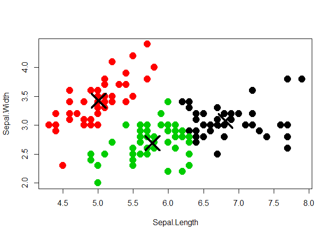

Projet MSS Les Iris - example
================
Mon nom
la date

Les Iris de Fisher est un fameux jeu de données, propice à la
classification. Notre objectif est de montrer les rudiments d’un
document 'RMarkdown' tricoté avec RStudio, pour en faire un document
‘Markdown’ visible sur GitHub. Si on renomme le fichier en READM.md à
la racine du dépôt, il s’affiche directement sous la liste des fichiers
du dépôt. Bien sûr le tricotage créera aussi un document html qu’on peut
aussi déposer sur GitHub, mais qui ne se visualise pas aussi facilement.

Pour commencer, on définit les options générales de knitr, à choisir…

``` r
# pour éditer avec les codes, sans les résultats
#knitr::opts_chunk$set(echo = T, message=F, eval=F, warning = F) 

# pour éditer sans les codes, avec les résultats
#knitr::opts_chunk$set(echo = F, message=F, eval=T, warning = F)

# pour éditer avec les codes et les résultats
knitr::opts_chunk$set(echo = T, message=F, eval=T, warning = F)
library(ggplot2)
```

# Récupération des données

Le jeu de données iris est déjà dans RStudio pour pouvoir y accéder :

``` r
data(iris)
```

On peut alors le manipuler, par exemple, le visualiser. En prévision
d’une conversion en Markdown (et pas seulement html), on utilise kable

``` r
knitr::kable(head(iris))
```

| Sepal.Length | Sepal.Width | Petal.Length | Petal.Width | Species |
| -----------: | ----------: | -----------: | ----------: | :------ |
|          5.1 |         3.5 |          1.4 |         0.2 | setosa  |
|          4.9 |         3.0 |          1.4 |         0.2 | setosa  |
|          4.7 |         3.2 |          1.3 |         0.2 | setosa  |
|          4.6 |         3.1 |          1.5 |         0.2 | setosa  |
|          5.0 |         3.6 |          1.4 |         0.2 | setosa  |
|          5.4 |         3.9 |          1.7 |         0.4 | setosa  |

# Premiers graphes

Cette section est surtout pour montrer les possibilités de formater le
texte. La cheat sheet de RMarkdown est visible ici sur cette page
:<https://rstudio.com/wp-content/uploads/2015/02/rmarkdown-cheatsheet.pdf>

Et un résumé sympa de la syntaxe Markdown ici
:<https://guides.github.com/features/mastering-markdown/>

Ce qu’il faut savoir : RMakdwon et Markdown, c’est différent \! Bon,
pour revenir à notre analyse, voici les graphes représentés

1.  le nuage de points selon les longueurs et largeurs de sépales
2.  le même pour les pétales
3.  la boite à moustaches des longueurs de pétales selon l’espèce
    d’iris.

<!-- end list -->

``` r
ggplot(data=iris, aes(x=Sepal.Length, y=Sepal.Width,col=Species)) + geom_point(size=3, alpha=0.7)+ggtitle('Graphe selon les Sépales')
```

<!-- -->

``` r
ggplot(data=iris, aes(x=Petal.Length, y=Petal.Width,col=Species)) + geom_point(size=3, alpha=0.7)+ggtitle('Graphe selon les Pétales')
```

<!-- -->

``` r
ggplot(data=iris, aes(x=Species, y=Petal.Length,col=Species)) + geom_boxplot()
```

<!-- -->

# Classification par kmeans

L’application shiny visible à
:<https://couallier.shinyapps.io/Les_Iris_de_Fisher/>

reprend ce graphe :

``` r
selectedData <- iris[, c(1,2)]
clusters <- kmeans(selectedData,3)
plot(selectedData,
         col = clusters$cluster,pch = 20, cex = 3)
points(clusters$centers, pch = 4, cex = 4, lwd = 4)
```

<!-- -->

La classification peut se faire sur la base de deux variables (et sa
représentation aussi), mais on peut aussi imaginer une classification
basée sur l’ensemble des variables, avec une représentation 2D.
Comparons avec :

``` r
clusters <- kmeans(iris[,1:4],3) # les 4 variables numériques
plot(selectedData,
         col = clusters$cluster,pch = 20, cex = 3)
points(clusters$centers, pch = 4, cex = 4, lwd = 4)
```

<!-- -->

On peut aussi proposer une table de classification pour comparer avec
les espèces :

``` r
knitr::kable(table(clusters$cluster,iris$Species))
```

| setosa | versicolor | virginica |
| -----: | ---------: | --------: |
|     50 |          0 |         0 |
|      0 |         48 |        14 |
|      0 |          2 |        36 |

Pour finir, après le tricotage et la création du html final, on peut
voir dans le dossier un fichier créé avec l’extension ‘.md’. On change
som nom en ‘README.md’, et on pousse sur GitHub.
